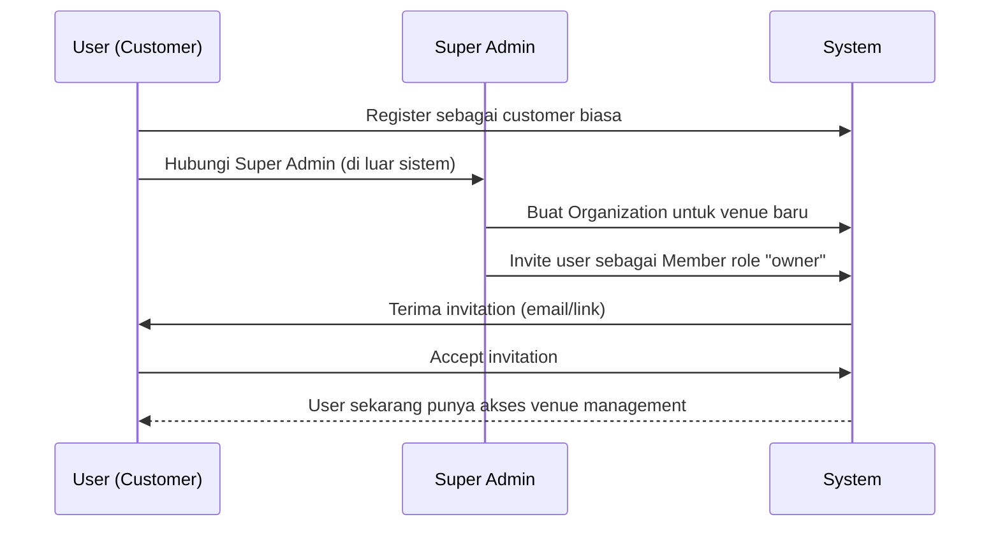

# Technical Specification

> [!NOTE]
> Dokumen ini menjabarkan **spesifikasi teknis** Quickcourt MVP.
> Untuk ringkasan eksekutif, lihat [Brief](./brief.md).
> Untuk kebutuhan fitur, lihat [PRD](./prd.md).
> Untuk roadmap dan milestone, lihat [Project Plan](./project-plan.md).

---

## 1. Booking & Payment State Machine

State machine harus dibuat eksplisit agar status booking, slot, payment, refund, dan ledger tidak saling bertentangan.

| Event                                     | Booking Status                | Booking Payment Status            | Booking Slot Status     | Record pembayaran                                               |
| ----------------------------------------- | ----------------------------- | --------------------------------- | ----------------------- | --------------------------------------------------------------- |
| Booking dibuat                            | `pending_payment`             | `pending` / `unpaid`              | `pending`               | `Payment.status = pending`                                      |
| Booking manual dibuat                     | `confirmed`                   | `unpaid`                          | `confirmed`             | Tidak ada record `Payment`                                      |
| Pembayaran offline dicatat                | `confirmed`                   | `paid`                            | `confirmed`             | Tidak ada record `Payment`                                      |
| Payment sukses                            | `confirmed`                   | `paid`                            | `confirmed`             | `Payment.status = paid`                                         |
| Payment expired                           | `expired`                     | `expired`                         | `cancelled`             | `Payment.status = expired`                                      |
| Payment gagal                             | `pending_payment` / `expired` | `failed`                          | `pending` / `cancelled` | `Payment.status = failed`                                       |
| Customer retry payment                    | `pending_payment`             | `pending`                         | `pending`               | Reuse active invoice atau create new `Payment.status = pending` |
| Customer cancel unpaid                    | `cancelled`                   | `unpaid` / `expired`              | `cancelled`             | `Payment.status = cancelled`, atau tidak ada record `Payment`   |
| Customer cancel paid ≥24 jam sebelum sesi | `cancelled`                   | `paid`                            | `cancelled`             | `Payment.status = paid`                                         |
| Customer cancel paid <24 jam sebelum sesi | `cancelled`                   | `paid`                            | `cancelled`             | `Payment.status = paid`                                         |
| Refund sukses                             | `cancelled`                   | `refunded` / `partially_refunded` | `cancelled`             | `Payment.status = refunded` / `partially_refunded`              |
| Sesi selesai                              | `completed`                   | `paid`                            | `completed`             | `Payment.status = paid`                                         |
| Customer tidak datang                     | `no_show`                     | `paid`                            | `no_show`               | `Payment.status = paid`                                         |

Aturan penting:

- `Booking.status`, `Booking.paymentStatus`, `BookingSlot.status`, dan `Payment.status` harus di-update melalui service layer yang sama.
- Webhook payment harus idempotent.
- Expired booking harus membatalkan slot agar slot kembali tersedia.
- Ledger hanya dibuat dari event finansial yang valid dan idempotent.
- Setiap `VenueLedgerEntry` wajib memiliki `idempotencyKey` unique yang berasal dari sumber event finansial, misalnya `payment:{paymentId}:booking_gross_credit`, `payment:{paymentId}:platform_commission_debit`, `refund:{refundId}:refund_debit`, atau `withdrawal:{withdrawalId}:withdrawal_debit`.
- Booking manual/walk-in langsung mengunci slot sebagai `confirmed`, tetapi tidak membuat `Payment` Xendit.
- Paid offline hanya boleh dicatat oleh Venue Owner atau Staff dengan permission `canManageBookings`. Aksi ini mengubah `Booking.paymentStatus` menjadi `paid`, tetapi tetap tidak membuat `Payment` Xendit.
- Paid offline wajib masuk `AuditLog` dengan nominal, metode offline, actor, dan timestamp. Paid offline tidak masuk saldo withdrawal platform dan tidak boleh dipakai untuk rekonsiliasi Xendit.
- Late cancellation tanpa refund (`refundAmount = 0`) tidak mengubah `Booking.paymentStatus`; status tetap `paid` karena tidak ada refund yang dieksekusi.
- Cancellation yang eligible refund tidak langsung mengubah `Booking.paymentStatus` menjadi `refunded`; refund MVP diproses semi-manual dan status payment baru berubah setelah refund sukses.
- Untuk booking online, hanya satu active pending payment attempt yang boleh dianggap current. Jika gateway mendukung reuse invoice, gunakan `checkoutUrl` existing. Jika membuat attempt baru, payment lama harus ditandai tidak aktif secara service-layer atau diabaikan saat webhook terlambat.
- Webhook payment sukses dari attempt lama harus diverifikasi terhadap booking status, payment status, amount, external ID, dan expiry sebelum mengubah booking menjadi `confirmed`.

---

## 2. Arsitektur Data

Schema Prisma Quickcourt menggunakan kombinasi model Better Auth dan model domain aplikasi.

| Layer            | Entitas                                                   | Fungsi                                        |
| ---------------- | --------------------------------------------------------- | --------------------------------------------- |
| **Auth**         | User, Session, Account, Verification                      | Identitas, sesi, login                        |
| **Organization** | Organization, Member, Invitation                          | Boundary akses venue owner/staff              |
| **Profile**      | UserProfile                                               | Data tambahan user seperti phone dan gender   |
| **Master Data**  | Sport, City, Facility                                     | Data referensi marketplace                    |
| **Venue**        | Venue, VenueBranch, VenuePhoto, VenueFacility, VenueSport | Data venue, cabang, foto, fasilitas, olahraga |
| **Staff Access** | MemberBranchAccess                                        | Permission staff per branch                   |
| **Court**        | Court, CourtPhoto, CourtOperatingHour, CourtPriceRule     | Lapangan, jadwal, harga                       |
| **Availability** | CourtAvailabilityBlock                                    | Blokir slot untuk maintenance/event/closed    |
| **Booking**      | Booking, BookingSlot, BookingCancellation, BookingCheckIn | Booking utama, slot, cancellation, check-in   |
| **Payment**      | Payment, PaymentWebhookEvent, Refund                      | Payment gateway, webhook, refund              |
| **Finance**      | VenueLedgerEntry, Withdrawal, WithdrawalLedgerEntry       | Ledger, saldo, withdrawal                     |
| **Invoice**      | Invoice, InvoiceItem                                      | Receipt dan dokumen transaksi                 |
| **Review**       | Review                                                    | Rating dan review venue                       |
| **Notification** | NotificationLog, BookingReminder                          | Email/reminder/log notifikasi                 |
| **Moderation**   | VenueApprovalRequest, UserSuspension, VenueSuspension     | Approval, suspend, ban                        |
| **Settings**     | PlatformSetting                                           | Konfigurasi platform seperti komisi           |
| **Audit**        | AuditLog                                                  | Audit trail aksi penting                      |

### 2.1 Model Role & Akses

Role produk Quickcourt tidak semuanya disimpan di `User.role`.

- **Customer** adalah user biasa yang sudah register/login dan dapat mengakses route user dashboard seperti `/dashboard`, `/dashboard/bookings`, `/dashboard/profile`, dan `/dashboard/settings`.
- **Super Admin** ditentukan dari Better Auth Admin Plugin melalui `User.role === "admin"`.
- **Venue Owner** ditentukan dari membership Organization: `Member.role === "owner"` dan dapat mengakses `/dashboard/venue/*`.
- **Venue Staff** ditentukan dari membership Organization: `Member.role === "member"`, dengan akses branch dan permission dari `MemberBranchAccess`, dan dapat mengakses `/dashboard/venue/*` sesuai permission.

Konsekuensinya, proteksi route `/dashboard/venue/*` harus mengecek membership Organization, bukan `User.role`. Proteksi route `/admin/*` memakai `User.role`. Owner dan staff tetap boleh mengakses route user seperti `/dashboard/bookings`, `/dashboard/profile`, dan `/dashboard/settings`.

### 2.2 Konvensi Route

Route group App Router seperti `(dashboard)` hanya untuk organisasi layout/protection dan tidak muncul di URL.

| Area               | URL                                                                              | Akses                            |
| ------------------ | -------------------------------------------------------------------------------- | -------------------------------- |
| Public marketplace | `/venues`, `/venues/[venueSlug]`                                                 | Public                           |
| User dashboard     | `/dashboard`, `/dashboard/bookings`, `/dashboard/profile`, `/dashboard/settings` | Semua authenticated user         |
| Venue management   | `/dashboard/venue`, `/dashboard/venue/*`                                         | Organization member: owner/staff |
| Super admin        | `/admin`, `/admin/ops`, `/admin/*`                                               | `User.role === "admin"`          |
| Support basic      | `/dashboard/support`                                                             | Semua authenticated user         |

---

## 3. Prinsip Teknis Utama

### 3.1 Anti Double-Booking Dua Lapis

Double-booking harus dicegah di dua lapisan:

1. **Application-level check**
   Sebelum booking dibuat, aplikasi mengecek apakah court memiliki booking slot aktif yang overlap pada rentang waktu yang diminta.

2. **Database-level constraint**
   PostgreSQL menggunakan `tstzrange` dan exclusion constraint untuk menolak overlap secara atomik pada level database.

Application-level check diperlukan untuk memberikan error yang ramah ke user. Database-level constraint diperlukan sebagai safety net terhadap race condition dan concurrent request.

### 3.2 BookingSlot sebagai Sumber Ketersediaan

Availability dihitung dari:

- `BookingSlot` aktif,
- `CourtAvailabilityBlock` aktif,
- `CourtOperatingHour`,
- `CourtPriceRule`,
- status court,
- status branch,
- status venue.

### 3.3 Semua Uang Disimpan sebagai BigInt

Semua nominal uang disimpan dalam satuan rupiah penuh menggunakan `BigInt`.

Contoh: `totalAmount`, `priceAmount`, `platformCommissionAmount`, `venueNetAmount`, `gatewayFeeAmount`, `refundAmount`, `withdrawal.amount`.

Tidak boleh menggunakan `Float` untuk nominal uang.

### 3.4 Snapshot Saat Transaksi

Data yang dapat berubah di masa depan harus disimpan sebagai snapshot saat transaksi dibuat:

- harga slot,
- price rule,
- komisi platform,
- cancellation policy,
- refund policy,
- detail invoice item.

Tujuannya agar histori transaksi tidak berubah meskipun konfigurasi venue berubah setelah booking.

### 3.5 Ledger sebagai Source of Truth Keuangan Venue

Saldo venue tidak dihitung langsung dari payment saja, tetapi dari ledger entries.

Ledger entry digunakan untuk:

- gross booking credit,
- platform commission debit,
- gateway fee debit,
- refund debit,
- withdrawal debit,
- withdrawal fee debit,
- manual adjustment.

### 3.6 Webhook Payment Harus Idempotent

Webhook dari payment gateway dapat dikirim lebih dari sekali. Karena itu, sistem harus menyimpan event webhook dan memastikan event yang sama tidak diproses dua kali.

### 3.7 Platform Setting Tidak Boleh Hardcoded

Komisi platform, kebijakan settlement, dan konfigurasi platform lain harus dibaca dari `PlatformSetting`, bukan hardcoded di service layer.

Untuk MVP, komisi hanya berasal dari `PlatformSetting.default_commission_bps`. Field `Venue.defaultCommissionBps` disiapkan untuk v2 dan tidak dipakai sebagai override di MVP.

### 3.8 Audit Trail untuk Aksi Penting

Aksi berikut harus masuk audit log:

- venue approval/rejection,
- venue suspension,
- user suspension,
- perubahan rekening bank,
- perubahan komisi,
- refund manual,
- withdrawal approval/rejection,
- cancellation oleh admin,
- manual adjustment ledger.

---

## 4. Known Schema Hardening Sebelum Implementasi

Schema saat ini sudah kuat untuk MVP marketplace, tetapi beberapa hal perlu dikunci sebelum implementasi penuh.

### 4.1 Customer Snapshot untuk Booking Manual

Karena `customerUserId` pada booking bisa nullable, booking walk-in menyimpan data customer manual.

Schema sudah memakai field eksplisit: `customerName`, `customerPhone`, dan `customerEmail`. Service layer wajib mengisi minimal nama atau nomor HP untuk booking manual/walk-in agar operasional venue tetap bisa menghubungi customer.

### 4.2 Source Config untuk Cancellation / Refund Policy

Untuk MVP, source policy sudah dikunci di `PlatformSetting.default_cancellation_policy` dan disalin ke `Booking.cancellationPolicySnapshot` saat booking dibuat.

Model `CancellationPolicy` per venue/branch adalah opsi evolusi v2 jika policy perlu berbeda antar venue.

### 4.3 Perkuat Idempotency Webhook

`PaymentWebhookEvent` wajib menyimpan `idempotencyKey` yang non-null dan unique.

Aturan key:

- Jika gateway mengirim event ID: `xendit:event:{eventId}`.
- Jika gateway tidak mengirim event ID: `xendit:fallback:{eventType}:{externalId}`.
- Jika `eventId` dan `externalId` sama-sama tidak ada, webhook ditolak sebagai payload tidak valid.

`gateway + eventId` tetap boleh disimpan sebagai constraint tambahan untuk event yang memiliki ID, tetapi service layer tidak boleh bergantung pada field nullable itu saja.

### 4.4 Tambahkan Constraint untuk Availability Block

Availability block perlu dicegah overlap dengan block lain pada court yang sama.

Selain itu, service layer harus memastikan:

- block tidak dibuat jika ada active booking,
- booking tidak dibuat jika overlap dengan active block.

### 4.5 Soft Delete dan Unique Constraint

Model yang punya `deletedAt` perlu partial unique index agar data soft-deleted tidak mengunci data baru.

Contoh area yang perlu diperhatikan: court name per branch, default branch per venue, primary bank account per venue, cover photo per venue/branch/court.

### 4.6 One Check-in Rule

Jika satu booking atau satu booking slot hanya boleh check-in sekali, perlu partial unique index atau validasi service layer untuk mencegah duplikasi check-in.

### 4.7 Bank Account Security

Nomor rekening venue harus diperlakukan sebagai data sensitif.

Rekomendasi: masking pada response API, audit log untuk perubahan rekening, enkripsi di level aplikasi jika diperlukan.

---

## 5. Platform-Level Cancellation Policy

Keputusan MVP #5 menetapkan cancellation policy berada di **level platform**:

- Customer boleh cancel sebelum sesi mulai.
- Cancel ≥24 jam sebelum sesi: refund 100%.
- Cancel <24 jam sebelum sesi: no refund, tetapi booking tetap dapat dicancel agar venue mendapat sinyal operasional.
- Setelah sesi mulai: cancellation tidak diizinkan; status operasional berikutnya adalah `completed` atau `no_show`.

### Mekanisme

Aturan pembatalan **disimpan di `PlatformSetting`**, bukan hardcoded di service layer dan bukan per-venue config (v2).

**Key:** `default_cancellation_policy`
**Value (Json):**

```json
{
  "scope": "platform",
  "allowCancelBeforeSessionStart": true,
  "allowCancelAfterSessionStart": false,
  "rules": [
    {
      "hoursBeforeSession": 24,
      "refundPercentage": 100,
      "description": "Free cancel ≥24 jam sebelum sesi"
    },
    {
      "hoursBeforeSession": 0,
      "refundPercentage": 0,
      "description": "No refund <24 jam sebelum sesi"
    }
  ]
}
```

### Alur

1. Saat booking dibuat, service layer membaca `PlatformSetting.default_cancellation_policy`.
2. Snapshot aturan disimpan ke `Booking.cancellationPolicySnapshot`.
3. Saat customer request cancel, service layer membaca snapshot (bukan PlatformSetting live) dan menghitung refund.
4. Ini memastikan perubahan policy di masa depan tidak retroaktif.
5. Jika hasil evaluasi refund `0`, sistem tetap membuat `BookingCancellation` dengan `refundAmount = 0`, mengubah `Booking.status` dan `BookingSlot.status` menjadi `cancelled`, tetapi membiarkan `Booking.paymentStatus = paid`.

### Evolusi v2

Jika nanti venue boleh atur policy sendiri, tambahkan model `CancellationPolicy` per venue. Service layer membaca venue policy dulu, fallback ke PlatformSetting jika tidak ada.

---

## 6. Background Jobs & Scheduler

Beberapa fitur MVP membutuhkan scheduled tasks atau deferred execution.

### Daftar Job

| Job                        | Trigger                         | Frekuensi                  | Milestone |
| -------------------------- | ------------------------------- | -------------------------- | --------- |
| **Booking expiry**         | 30 menit setelah booking dibuat | Tiap 5 menit + lazy check  | 5         |
| **Ledger settlement**      | T+1 setelah sesi selesai        | Harian                     | 7         |
| **Booking auto-complete**  | Setelah sesi berakhir           | Tiap 15 menit + lazy check | 6         |
| **Booking reminder email** | 2 jam sebelum sesi              | Tiap 15 menit              | 8         |

### Strategi MVP: Cron API Route + Lazy Check

MVP menggunakan **dua lapisan**:

**1. Lazy check (optimistic):**
Saat booking di-query (customer lihat booking, venue lihat venue management), service layer cek apakah booking sudah expired/perlu auto-complete. Jika ya, update status saat itu juga. Ini memastikan user selalu melihat status terbaru.

**2. Cron API route terpisah (background sweep):**
Setiap job punya endpoint sendiri agar lebih mudah dites, dipantau, dan di-retry:

- `/api/cron/expire-bookings` — expire booking yang sudah lewat 30 menit tanpa payment.
- `/api/cron/complete-bookings` — auto-complete booking yang sesinya sudah lewat.
- `/api/cron/send-reminders` — kirim reminder email untuk booking yang mendekati waktu sesi.
- `/api/cron/settle-ledger` — update ledger status dari `pending` ke `available` untuk booking T+1.

Endpoint ini dilindungi dengan **secret key** di header (`CRON_SECRET`), dipanggil oleh:

- **Vercel Cron** — jika deploy di Vercel (`vercel.json` → cron config)
- **External cron service** — jika deploy di VPS (cron-job.org, atau system crontab)

### Konfigurasi Cron

```
# Setiap 5 menit — booking expiry
*/5 * * * * curl -H "Authorization: Bearer $CRON_SECRET" https://app/api/cron/expire-bookings

# Setiap 15 menit — booking auto-complete
*/15 * * * * curl -H "Authorization: Bearer $CRON_SECRET" https://app/api/cron/complete-bookings

# Setiap 15 menit — reminder email
*/15 * * * * curl -H "Authorization: Bearer $CRON_SECRET" https://app/api/cron/send-reminders

# Setiap hari jam 02:00 — ledger settlement
0 2 * * * curl -H "Authorization: Bearer $CRON_SECRET" https://app/api/cron/settle-ledger
```

### Prinsip

- Semua cron job harus **idempotent** — bisa dijalankan berulang tanpa side effect.
- Lazy check mengurangi dependency pada cron — jika cron telat, user tetap melihat status benar.
- Cron hanya untuk **sweep** booking/ledger yang belum ter-catch oleh lazy check.

---

## 7. File Upload & Storage

### Strategi MVP

File upload (foto venue, court, branch) menggunakan **Uploadthing** untuk MVP.

| Aspek         | Keputusan                                                                  |
| ------------- | -------------------------------------------------------------------------- |
| **Provider**  | Uploadthing                                                                |
| **Alasan**    | Integrasi native Next.js App Router, simple API, free tier cukup untuk MVP |
| **Tipe file** | Image (JPEG, PNG, WebP)                                                    |
| **Max size**  | 4MB per file                                                               |
| **Storage**   | Managed oleh Uploadthing (S3-backed)                                       |
| **URL**       | URL publik dari Uploadthing CDN, disimpan di `imageUrl` fields             |

### Evolusi

Jika di v2 biaya Uploadthing menjadi concern, migrasi ke Cloudflare R2 atau AWS S3 langsung. Karena `imageUrl` hanyalah string URL, migrasi hanya mengubah upload handler tanpa mengubah schema.

### Kapan Dibutuhkan

Milestone 2 (Venue Onboarding) — saat venue owner upload foto venue dan court. Tidak dibutuhkan di Milestone 1.

---

## 8. Slot Generation Strategy

### Keputusan: On-the-fly Calculation

Slot availability **dihitung saat customer membuka halaman**, bukan pre-generated di database.

### Algoritma

```
Input: courtId, date, venueTimezone
Output: Array<{ startTime, endTime, status, price }>

1. Ambil OperatingHour untuk court + dayOfWeek(date)
   → Jika tidak ada → return [] (court tutup hari itu)

2. Ambil CourtAvailabilityBlock yang overlap dengan date
   → Tandai blocked windows

3. Generate time windows dari openTime s/d closeTime
   dengan interval = Court.slotDurationMinutes
   → Contoh: 08:00–22:00, durasi 60 min → 14 windows

4. Ambil BookingSlot yang memblokir ketersediaan
   (status `pending`, `confirmed`, atau `completed`) yang overlap dengan date + courtId.
   Booking expired harus sudah mengubah slot menjadi `cancelled`.

5. Untuk setiap window:
   - Jika overlap dengan BookingSlot aktif → status: "booked"
   - Jika overlap dengan AvailabilityBlock → status: "blocked"
   - Else → status: "available"

6. Hitung harga per slot:
   - Ambil PriceRule yang match (dayOfWeek, timeRange, priority)
   - Fallback ke Court.basePriceAmount jika tidak ada rule
```

### Multi-slot Booking: Contiguous Only

Customer **hanya bisa memilih slot berturutan** (misal 08:00 + 09:00 + 10:00). Slot terpisah (08:00 + 10:00 tanpa 09:00) menghasilkan 2 booking terpisah.

Alasan:

- 1 booking = 1 time range kontinu → simple untuk exclusion constraint
- UX booking lapangan pada umumnya berurutan
- Mengurangi kompleksitas pricing dan refund

---

## 9. Venue Owner Registration Flow

### Keputusan: Super Admin Approval

User **tidak bisa menjadi venue owner secara mandiri**. Alur:



### Detail

1. **Register:** Semua user register sebagai customer (role default).
2. **Request venue:** User menghubungi Super Admin (via form/email/WhatsApp — di luar sistem untuk MVP).
3. **Super Admin creates Organization:** SA membuat Organization baru dan mengundang user sebagai `owner`.
4. **User accepts:** User menerima invitation → otomatis jadi Member dengan role `owner`.
5. **Venue onboarding:** User yang sudah jadi owner bisa mengakses `/dashboard/venue/*` dan mulai membuat Venue, Branch, Court, dsb.

### Post-Approval Flow (Venue Owner)

Setelah menjadi owner, user mengikuti venue onboarding flow:

```
1. Isi detail venue (nama, deskripsi, logo)
2. Isi detail branch default (alamat, kota, timezone)
3. Tambah bank account
4. Upload foto venue
5. Submit untuk review Super Admin
6. Super Admin approve → Venue status: approved → muncul di marketplace
```

### Catatan

- Satu user **bisa tetap jadi customer** sekaligus venue owner (dual role).
- Cek akses `/dashboard/venue/*` bukan lewat `User.role`, tapi lewat membership di Organization mana pun.
- Di v2, bisa dibuat self-service registration flow dengan approval queue.

---

## 10. Webhook Security (Xendit)

### Verifikasi Callback Token

Xendit menggunakan **X-CALLBACK-TOKEN** header untuk verifikasi webhook. Token ini di-set di Xendit Dashboard dan dikirim di setiap webhook request.

### Implementasi

```typescript
// /app/api/webhooks/xendit/route.ts

export async function POST(request: Request) {
  const callbackToken = request.headers.get("x-callback-token")

  if (callbackToken !== process.env.XENDIT_CALLBACK_TOKEN) {
    return Response.json({ error: "Unauthorized" }, { status: 401 })
  }

  const body = await request.json()

  const eventId = body.id ?? null
  const eventType = body.event
  const externalId = body.data?.id ?? null
  if (!eventId && !externalId) {
    return Response.json({ error: "Invalid webhook payload" }, { status: 400 })
  }

  const idempotencyKey = eventId
    ? `xendit:event:${eventId}`
    : `xendit:fallback:${eventType}:${externalId}`

  const status = await db.$transaction(async (tx) => {
    // Serialize duplicate concurrent webhook attempts for the same key.
    await tx.$executeRaw`
      SELECT pg_advisory_xact_lock(hashtextextended(${idempotencyKey}, 0))
    `

    const event = await tx.paymentWebhookEvent.upsert({
      where: { idempotencyKey },
      update: {},
      create: {
        gateway: "xendit",
        eventType,
        eventId,
        externalId,
        idempotencyKey,
        payload: body,
      },
    })

    if (event.processedAt) {
      return "already_processed"
    }

    // Process event with the same transaction client.
    // This updates booking/payment status and creates ledger entries idempotently.
    await processWebhookEvent(tx, event)

    await tx.paymentWebhookEvent.update({
      where: { id: event.id },
      data: {
        processingStatus: "processed",
        processedAt: new Date(),
      },
    })

    return "ok"
  })

  return Response.json({ status })
}
```

Catatan implementasi:

- Jangan memakai pola `findFirst` lalu `create` untuk webhook idempotency karena dua request bersamaan masih bisa race.
- `idempotencyKey` tetap wajib unique di database.
- `processWebhookEvent` harus menerima transaction client agar update status booking, payment, ledger, dan `processedAt` berada dalam satu boundary atomik.

### Environment Variable

```
XENDIT_CALLBACK_TOKEN="token-dari-xendit-dashboard"
```

### Checklist Keamanan

- [ ] Endpoint **tidak di-protect** oleh auth middleware (Xendit bukan user)
- [ ] Callback token diverifikasi di setiap request
- [ ] Event disimpan sebelum diproses (bisa replay jika gagal)
- [ ] Idempotency check mencegah double processing
- [ ] Response 200 OK dikembalikan secepat mungkin (Xendit retry jika timeout)

---

## 11. Search Strategy

### MVP: SQL ILIKE

Pencarian venue menggunakan **PostgreSQL ILIKE** untuk fuzzy matching pada dataset kecil (<100 venue).

```sql
SELECT * FROM venues v
JOIN venue_branches vb ON vb.venue_id = v.id
JOIN venue_sports vs ON vs.venue_id = v.id
JOIN sports s ON s.id = vs.sport_id
WHERE v.status = 'approved'
  AND (v.name ILIKE '%futsal%' OR s.name ILIKE '%futsal%')
  AND vb.city_id = :cityId
ORDER BY v.average_rating DESC
LIMIT 20 OFFSET :offset
```

### Evolusi v1.2+

Jika dataset berkembang dan ILIKE terlalu lambat, migrasi ke PostgreSQL Full-Text Search (`tsvector`, `tsquery`) tanpa perlu external search engine.

---

## 12. Booking Code Format

### Format: `QC` + nanoid (8 karakter uppercase)

```
Contoh: QC-A7K3M9XP, QC-B2N4R8YQ
```

### Spesifikasi

| Aspek              | Detail                                                        |
| ------------------ | ------------------------------------------------------------- |
| **Prefix**         | `QC-` (QuickCourt)                                            |
| **Body**           | 8 karakter dari alphabet `0123456789ABCDEFGHJKLMNPQRSTUVWXYZ` |
| **Excluded chars** | `I`, `O` (menghindari ambiguitas dengan `1`, `0`)             |
| **Collision rate** | ~1 in 1 triliun pada 1000 bookings/hari                       |
| **Case**           | Uppercase only — mudah dibaca via telepon/WhatsApp            |

### Implementasi

```typescript
import { customAlphabet } from "nanoid"

const generateBookingCode = customAlphabet(
  "0123456789ABCDEFGHJKLMNPQRSTUVWXYZ",
  8
)

export function createBookingCode(): string {
  return `QC-${generateBookingCode()}`
}
```

---

## 13. Error Handling Strategy

### Arsitektur: Global Boundary + Route Group Error Pages

**1. Root Error Boundary** (`/app/error.tsx`):

- Menangkap semua unhandled errors di seluruh app.
- Menampilkan halaman error generik dengan tombol retry.

**2. Global Error Boundary** (`/app/global-error.tsx`):

- Menangkap error di root layout/template.
- Wajib mendefinisikan `<html>` dan `<body>`.
- Menampilkan fallback generik tanpa stack trace atau raw error message.

**3. Error Pages per Route Group:**

```
/app/(dashboard)/error.tsx → "Dashboard unavailable."
/app/(admin)/error.tsx     → "Admin area unavailable."
```

Route group error pages must not display stack traces, raw error messages, or internal error details to end users.

**4. Not Found** (`/app/not-found.tsx`):

- Halaman 404 yang branded dan helpful.

**5. Server-side Error Normalization** (`/lib/errors.ts`):

- `normalizeError(error)` mengembalikan safe error shape untuk UI/API responses.
- `logError(error, message, context)` mengirim error ke structured logger dan mengembalikan safe error shape.
- Server-side logging boleh menyimpan detail error untuk debugging, tetapi logger redaction tetap harus melindungi secrets/PII.

**6. Server Action Errors:**

- Semua server actions mengembalikan `{ success, data, error }` — tidak pernah throw di happy path.
- Error ditampilkan via Sonner toast di client.

**7. Form Validation Errors:**

- Zod validation errors ditampilkan inline di form fields.
- Server-side validation errors dimapping ke field yang sesuai.

---

## 14. Structured Logging

### Library: Pino

Pino dipilih karena: JSON-native, sangat cepat, low overhead, dan standar di ekosistem Node.js.

### Setup

```typescript
// /lib/logger.ts
import pino from "pino"

import { serverEnv } from "@/config/env"

export const logger = pino({
  level: serverEnv.LOG_LEVEL,
  redact: {
    paths: loggerRedactionPaths,
    censor: "[Redacted]",
  },
  transport:
    serverEnv.NODE_ENV === "development"
      ? { target: "pino-pretty", options: { colorize: true } }
      : undefined,
})

// Usage di service layer:
logger.info({ bookingId, userId }, "Booking created")
logger.error({ err, webhookId }, "Webhook processing failed")
```

### Area Logging

| Area                   | Level            | Contoh                                                 |
| ---------------------- | ---------------- | ------------------------------------------------------ |
| **Booking lifecycle**  | `info`           | Created, confirmed, completed, cancelled, expired      |
| **Payment events**     | `info`           | Payment initiated, webhook received, status changed    |
| **Webhook processing** | `info` + `error` | Event received, processed, failed                      |
| **Auth events**        | `info`           | Login, register, logout, failed attempt                |
| **Cron jobs**          | `info`           | Job started, X bookings expired, job completed         |
| **Unexpected errors**  | `error`          | Unhandled exceptions, DB errors, external API failures |

### Redaction

Logger wajib menyensor field sensitif secara default sebelum output ditulis. Minimal field yang disensor:

- `password`
- `token`
- `accessToken`
- `refreshToken`
- `secret`
- `authorization`
- `cookie`
- `resetToken`
- `verificationToken`
- `sessionToken`
- `email`
- `phone`
- `name`
- `address`
- `ip`
- `userAgent`
- OTP/MFA fields
- payment-sensitive identifiers

Gunakan structured fields seperti `logger.info({ userId, bookingId }, "Event")` dan hindari memasukkan PII ke message string.

### Dependencies

```
npm i pino
npm i -D pino-pretty
```

---

## 15. Rate Limiting

Rate limiting QuickCourt dibagi menjadi dua area agar tidak menduplikasi fitur auth provider.

### 15.1 Auth Endpoint Rate Limiting — Better Auth

Endpoint auth memakai built-in Better Auth `rateLimit` sejak Milestone 1.

Area yang di-protect oleh Better Auth:

| Endpoint / Flow                  | Owner       | Milestone | Catatan                                     |
| -------------------------------- | ----------- | --------- | ------------------------------------------- |
| Email/password register          | Better Auth | 1         | Cegah spam registration                     |
| Email/password login             | Better Auth | 1         | Cegah brute force                           |
| Forgot password / reset password | Better Auth | 1         | Response tidak boleh reveal email existence |
| Email verification               | Better Auth | 1         | Menggunakan transactional email abstraction |

Implementation note:

- Jangan membuat custom middleware rate limit untuk endpoint auth di Milestone 1.
- Konfigurasi `rateLimit` Better Auth harus production-ready.
- Jika Redis/secondary storage dipakai, gunakan sebagai storage backend untuk Better Auth, bukan duplicate limiter di route auth.
- Development boleh memakai konfigurasi lebih longgar agar local testing tidak sulit.

### 15.2 Custom App-Level Rate Limiting — Non-Auth Endpoint

Custom app-level limiter untuk endpoint non-auth ditunda sampai endpoint tersebut ada atau sampai hardening.

Library kandidat: `@upstash/ratelimit` + `@upstash/redis`.

Upstash dipilih karena serverless-friendly, mendukung sliding window algorithm, dan sederhana untuk Vercel/Node.js.

Area kandidat:

| Endpoint / Area             | Limit awal | Window   | Target Milestone | Alasan                    |
| --------------------------- | ---------- | -------- | ---------------- | ------------------------- |
| `POST /api/bookings`        | 10 req     | 1 menit  | 9 / hardening    | Cegah spam booking        |
| `POST /api/webhooks/xendit` | 100 req    | 1 menit  | 5 atau 9         | Proteksi webhook endpoint |
| Support request submission  | 5 req      | 15 menit | 6 atau 9         | Cegah spam support        |

### Contoh Implementasi Custom Non-Auth Limiter

```typescript
import { Ratelimit } from "@upstash/ratelimit"
import { Redis } from "@upstash/redis"

const redis = new Redis({
  url: process.env.UPSTASH_REDIS_REST_URL!,
  token: process.env.UPSTASH_REDIS_REST_TOKEN!,
})

const bookingLimiter = new Ratelimit({
  redis,
  limiter: Ratelimit.slidingWindow(10, "1 m"),
  prefix: "ratelimit:booking-create",
})

// Di API route non-auth:
const ip = request.headers.get("x-forwarded-for") ?? "unknown"
const { success } = await bookingLimiter.limit(ip)
if (!success) {
  return Response.json({ error: "Too many requests" }, { status: 429 })
}
```

### Environment Variables untuk Custom Limiter

```
UPSTASH_REDIS_REST_URL="https://xxx.upstash.io"
UPSTASH_REDIS_REST_TOKEN="xxx"
```

### Catatan Milestone

- Milestone 1: gunakan Better Auth built-in `rateLimit` untuk auth endpoints.
- Milestone 5: webhook endpoint boleh memakai additional limiter jika dibutuhkan, tetapi idempotency dan callback token verification tetap wajib.
- Milestone 9: custom app-level rate limiting untuk endpoint kritis dipastikan sebagai bagian hardening/release readiness.
- Untuk development lokal, custom limiter bisa disable atau gunakan in-memory fallback.

---

## 16. Account Recovery & Auth Security

Account recovery adalah kebutuhan MVP karena semua role memakai email/password.

Requirement teknis:

- Forgot password menghasilkan token sekali pakai melalui Better Auth verification flow atau mekanisme setara.
- Token reset password harus memiliki expiry pendek dan tidak boleh disimpan plaintext jika custom implementation dipakai.
- Change password dari `/dashboard/settings` wajib meminta password lama atau sesi fresh.
- Semua event penting masuk `AuditLog`: reset requested, reset succeeded, password changed, failed login berulang jika tersedia.
- Email reset password dikirim melalui provider transactional email dan dicatat di `NotificationLog` jika feasible.

Security note:

- Response forgot password tidak boleh mengungkap apakah email terdaftar.
- Rate limit wajib diterapkan pada login, register, forgot password, dan reset password.

---

## 17. Payment Failure, Retry, and Late Webhook Handling

### Prinsip

Payment retry harus membantu customer menyelesaikan pembayaran tanpa membuka celah double-confirmation atau double-ledger.

### Aturan Payment Attempt

1. Booking online dibuat dengan `Booking.status = pending_payment`, `Booking.paymentStatus = pending`, dan slot `pending`.
2. Jika Xendit invoice masih aktif, tombol “Lanjutkan pembayaran” memakai `Payment.checkoutUrl` existing.
3. Jika payment attempt gagal tetapi booking belum expired, service boleh membuat attempt baru sesuai constraint gateway.
4. Payment attempt baru harus memiliki `externalId` unik dan amount sama dengan snapshot booking.
5. Booking expired membatalkan semua slot pending dan menutup retry; customer harus membuat booking baru.

### Late Webhook Guard

Sebelum webhook mengubah booking menjadi `confirmed`, service wajib mengecek:

- `booking.status === pending_payment`,
- `booking.paymentStatus === pending`,
- `payment.status === pending`,
- amount dan currency cocok dengan booking snapshot,
- payment belum expired,
- payment attempt masih current untuk booking tersebut.

Jika guard gagal, webhook tetap disimpan sebagai `PaymentWebhookEvent`, tetapi processing result menjadi `ignored` atau `failed` dengan `errorMessage` yang jelas. Ledger tidak boleh dibuat.

### UI Requirement

Detail booking `pending_payment` harus menampilkan:

- countdown expiry,
- payment status terakhir,
- tombol lanjutkan pembayaran,
- instruksi retry jika payment gagal,
- instruksi membuat booking baru jika expired.

---

## 18. Refund & Cancellation Operations

### Refund MVP

Refund tetap semi-manual, tetapi status dan ledger harus konsisten.

Flow teknis:

1. Customer/venue/admin melakukan cancellation sebelum sesi mulai.
2. Service mengevaluasi policy snapshot pada booking.
3. Jika refund amount > 0, buat `Refund.status = pending` atau `processing` sesuai flow dashboard.
4. Admin/owner dengan permission memicu refund ke Xendit.
5. Jika refund sukses, update `Refund.status = succeeded`, update `Payment.status` menjadi `refunded` atau `partially_refunded`, lalu buat ledger `refund_debit` idempotent.
6. Jika refund gagal, update `Refund.status = failed` dan simpan `failureReason`; jangan buat ledger refund debit.

Idempotency key ledger refund:

```text
refund:{refundId}:refund_debit
```

Cancellation no-refund:

- Booking menjadi `cancelled`.
- Slot menjadi `cancelled`.
- `Booking.paymentStatus` tetap `paid` jika booking sudah dibayar.
- Tidak ada `Refund` dan tidak ada ledger refund debit.

---

## 19. Withdrawal & Bank Account Operations

### Withdrawal Lifecycle

Status yang digunakan:

```text
requested → approved → processing → paid
requested → rejected
processing → failed
requested/approved → cancelled
```

Aturan saldo:

- Withdrawal hanya memakai ledger entries berstatus `available`.
- Ledger withdrawal debit dibuat idempotent dengan key `withdrawal:{withdrawalId}:withdrawal_debit`.
- Withdrawal fee jika ada memakai key `withdrawal:{withdrawalId}:withdrawal_fee_debit`.
- Jika withdrawal gagal sebelum paid, saldo tidak boleh hilang. Implementasi boleh menahan ledger debit sebagai `pending` sampai payout sukses, atau membuat reversal/adjustment yang jelas dan diaudit.

### Bank Account

- `VenueBankAccount.accountNumber` sebaiknya dienkripsi atau minimal dimasking di semua UI/log.
- `VenueBankAccount.accountNumberLast4` disimpan untuk kebutuhan display, audit tersensor, dan verifikasi manual tanpa membuka nomor rekening penuh.
- Hanya satu primary account per venue lewat partial unique index.
- Perubahan rekening wajib masuk `AuditLog` dengan before/after yang sudah disensor.
- Super Admin dapat melakukan verifikasi manual dengan audit log.

---

## 20. Staff Management & Permission Enforcement

Venue Owner mengelola staff melalui Organization membership dan `MemberBranchAccess`.

Requirement teknis:

- Invite staff memakai Better Auth Organization invitation atau mekanisme invitation yang kompatibel.
- Staff revoked harus kehilangan akses `/dashboard/venue/*` segera setelah session berikutnya divalidasi.
- Permission branch dicek di service layer, bukan hanya UI.
- Aksi berikut wajib audit: invite, accept, revoke, permission changed, branch assigned/removed.
- Staff finance access default `false`; hanya owner yang bisa memberi `canViewFinance` jika MVP mengizinkan.

---

## 21. Admin Transaction Ops & Support Basic

### Admin Ops

Super Admin membutuhkan tooling investigasi, bukan hanya analytics.

Minimal query/filter:

- Booking: booking code, customer email, venue, branch, tanggal, status.
- Payment: `externalId`, `gatewayInvoiceId`, status, booking code.
- Webhook: event type, external ID, processing status, error message.
- Refund: booking code, status, amount, failure reason.
- Withdrawal: venue, status, amount, bank account, gateway disbursement ID.
- Ledger: booking/payment/refund/withdrawal ID, venue, status, type.

Manual adjustment:

- Hanya Super Admin.
- Reason wajib.
- Amount memakai BigInt.
- Membuat `VenueLedgerEntry` dengan idempotency key unik.
- Masuk `AuditLog`.

### Support Basic

MVP tidak wajib punya dispute engine atau live chat.

Implementasi paling sederhana:

- Form “Butuh bantuan?” mengirim email/internal notification dengan konteks entity terkait.
- Support action dari admin dicatat di `AuditLog`.
- Jika ingin support queue in-app pada v1.1, tambahkan model `SupportTicket`; jika tidak, cukup email + audit log untuk MVP launch.

---

## 22. Legal Consent & Policy Snapshot

Checkout wajib menampilkan ringkasan policy dan checkbox persetujuan.

Data yang harus tersimpan pada booking:

- cancellation/refund policy snapshot,
- timestamp consent,
- versi policy jika tersedia,
- IP/user agent jika ingin audit lebih kuat.

Perubahan policy hanya berlaku untuk booking baru. Booking lama selalu memakai snapshot yang disimpan saat checkout.
